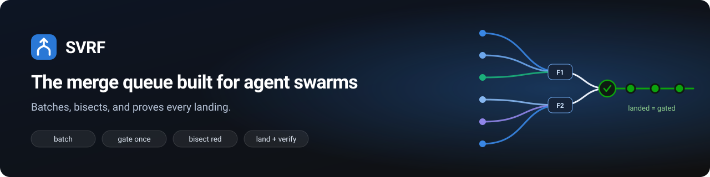
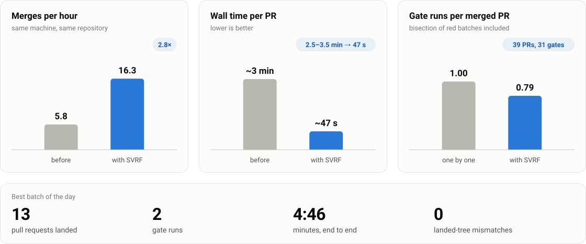
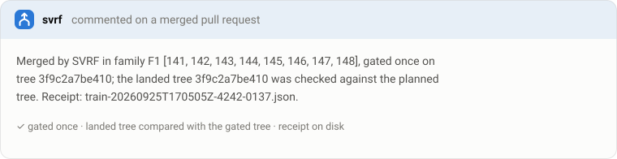
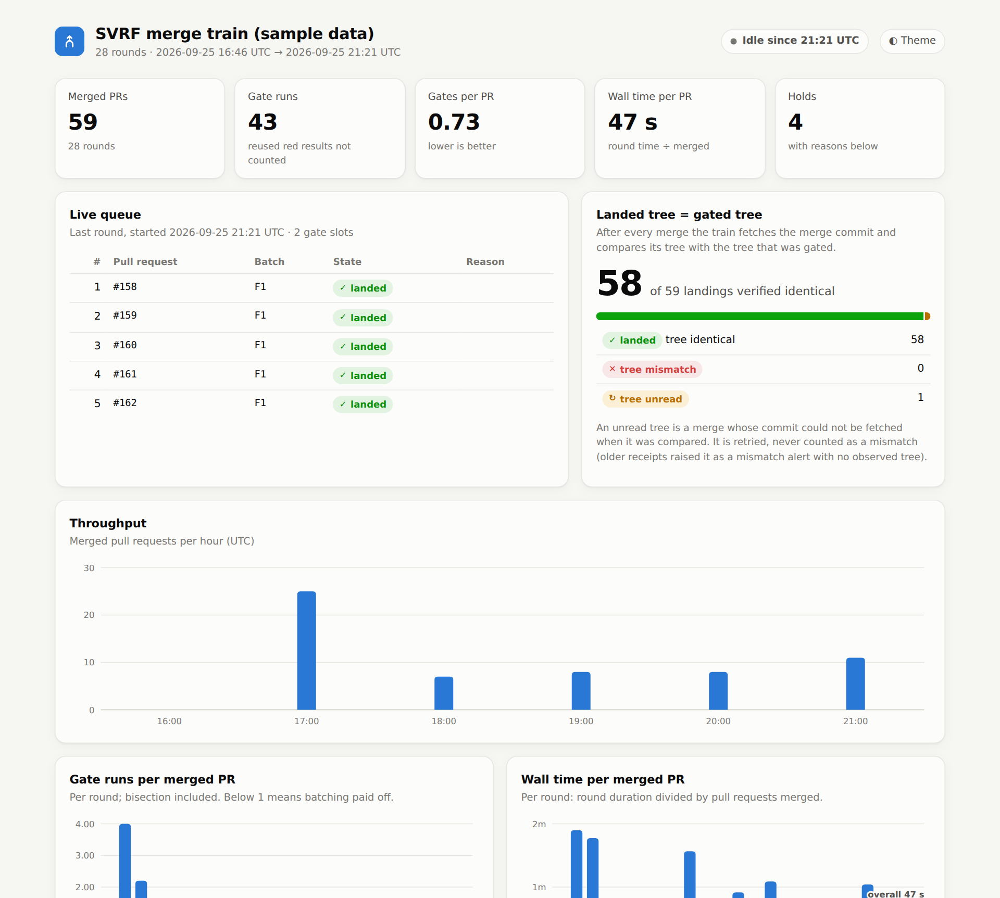
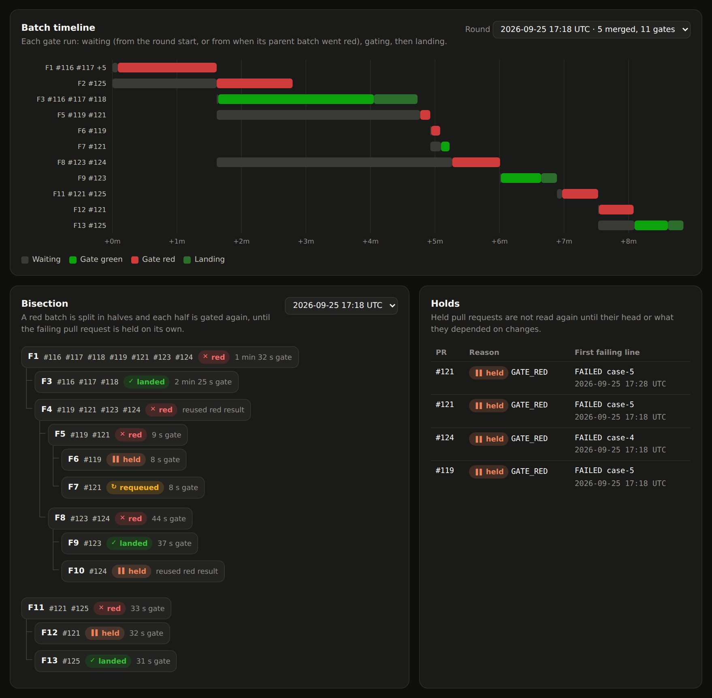
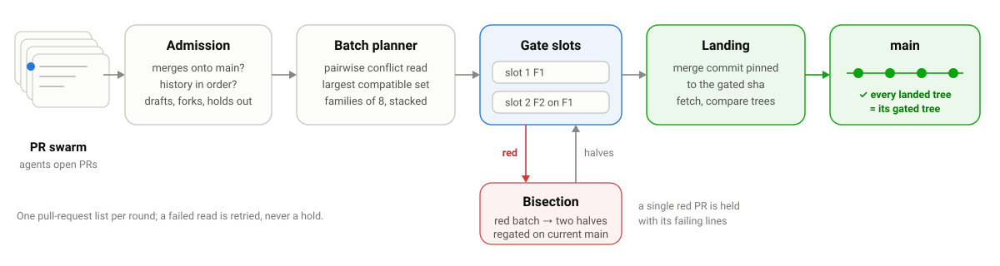

<p align="center">
  
</p>

# Silicon Valley Rocket Fuel (SVRF)

**The merge queue built for agent swarms — batches, bisects, and proves every landing.**

[](https://github.com/nybarius/SVRF/actions/workflows/ci.yml)
[](LICENSE)
[](proofs/README.md)


SVRF is a merge train for repositories where agents open pull requests faster than CI can
gate them one by one. It watches a GitHub repository, folds compatible ready pull requests
together, runs **your** gate command once on the folded tree, bisects a red batch down to
the pull request that broke it, and lands the rest with ordinary merge commits, checking
after every merge that the base branch holds exactly the tree that was gated. The
scheduling technique inside is a *braided train*: pull requests that do not conflict are
braided into families that gate in parallel; the ones that do conflict wait for a later
round.

<p align="center">
  
</p>

On a 17,000-declaration Lean monorepo fed by coding agents it went from 5.8 to 16.3 merges
per hour on the same machine, about 47 s of wall time per merged PR, 0.79 gate runs per
merged PR with bisection included, and 0 landed-tree mismatches. One day, one repository,
and the "after" window was arrival-bound: details and caveats in
[docs/BENCHMARK.md](docs/BENCHMARK.md).

## Quickstart

**0. Watch it work first (optional, no GitHub needed).** A fake agent swarm opens eight
pull requests against a local bare repository (two conflicting, one failing its own
test, one committed out of order, one stacked on another), and the real train code
lands them:

```sh
python3 demo/run_demo.py
```

**1. Install.** Either add the published GitHub Action. It needs no local install and no
`svrf.toml`: on its first run it detects your project and gate command.

```yaml
# .github/workflows/svrf.yml
name: svrf
on:
  schedule:
    - cron: "*/5 * * * *"
  pull_request:
    types: [ready_for_review]
jobs:
  round:
    runs-on: ubuntu-latest
    concurrency: { group: svrf-round, cancel-in-progress: false }
    steps:
      - uses: actions/checkout@v4
      - uses: nybarius/SVRF@v0.1.0
        with:
          github-token: ${{ secrets.SVRF_TOKEN }}   # see docs/GITHUB_SETUP.md for scopes
```

Or install the CLI, to run it on your own machine, in a container or on a self-hosted
runner (Python 3.11+, git and the `gh` CLI):

```sh
pipx install git+https://github.com/nybarius/SVRF   # or: pip install git+https://github.com/nybarius/SVRF
```

Either way the token (`GH_TOKEN` or `secrets.SVRF_TOKEN`) needs permission to push
branches and merge pull requests ([docs/GITHUB_SETUP.md](docs/GITHUB_SETUP.md)).

**2. Configure.** The Action needs nothing further. With the CLI, `svrf init` writes
`svrf.toml` by detection (project type, gate command, base branch, repository), asking at
most three questions with sensible defaults; `svrf doctor` then checks the token's
scopes, branch protection, and that the gate command actually runs.

```sh
svrf init        # --yes accepts every default; --repo/--base/--gate override one
svrf doctor
```

`svrf init` never overwrites an existing `svrf.toml` or workflow file unless you pass
`--force`. Presets for Lean, Python and Node are in [presets/](presets/).

**3. Run.**

```sh
svrf run --once          # one round; or `svrf watch` to keep going
```

or install the systemd timer (`bash systemd/install.sh --enable`), or run it in Docker:

```sh
docker build -t svrf .
docker run -d --name svrf -e GH_TOKEN -v "$PWD/svrf.toml:/config/svrf.toml:ro" -v svrf-state:/var/lib/svrf svrf
docker logs -f svrf
```

See [docs/ACTION.md](docs/ACTION.md) for the Action's inputs and zero-config behaviour,
and [docs/AGENTS.md](docs/AGENTS.md) for `svrf why`, `svrf status --json` and `svrf mcp`:
a coding agent whose pull request gets held can find out why and fix it itself.

## What you'll see

The demo, as it runs ([docs/demo.cast](docs/demo.cast) is the asciinema recording;
`asciinema play docs/demo.cast`):

<p align="center"></p>

On every pull request it merges, a comment naming the batch it was gated in, the gated
tree, and the receipt:

<p align="center"></p>

And `svrf dashboard` builds a static site from the round receipts: live queue, throughput,
gates and wall time per PR, a batch timeline, the bisection tree of every red batch, holds,
and the landed-tree = gated-tree tally. One self-contained `index.html`: open it from disk
or publish it to GitHub Pages ([docs/DASHBOARD.md](docs/DASHBOARD.md)). Shown here on
anonymized receipts from a real day of runs (`make dashboard-sample`):

<p align="center"></p>

<p align="center"></p>

## Commands

| Command | What it does |
| --- | --- |
| `svrf init` | detect the project and write `svrf.toml` (and a scheduled workflow); needs no config |
| `svrf doctor` | read-only checks: token scopes, branch protection, gate command, rate budget |
| `svrf run --once` | one round: discover, admit, gate, land (what the timer runs) |
| `svrf watch` | a round every `train.interval_seconds` |
| `svrf plan --dry-run` | one round that gates and reports but pushes, merges and remembers nothing |
| `svrf land --prs 12,15` | one batched run over the named pull requests |
| `svrf status [--json]` | held pull requests and the last round, from local state only |
| `svrf why 12` | why one pull request is held or queued, and what to do next ([docs/AGENTS.md](docs/AGENTS.md)) |
| `svrf mcp` | an MCP server over stdio for coding agents: queue status, why held, requeue ([docs/AGENTS.md](docs/AGENTS.md)) |
| `svrf forget 12,15` | drop pull requests from the held memory |
| `svrf dashboard --receipts DIR --out DIR` | a static site from the round receipts ([docs/DASHBOARD.md](docs/DASHBOARD.md)); needs no config or token |

## How a round works

<p align="center"></p>

1. **One list.** Read GitHub's rate budget, then one pull-request list. An idle round
   costs exactly that.
2. **Admission.** Skip drafts, forks, pull requests with the hold label and ones based
   on another branch. A stacked pull request waits for its parent and is retargeted to
   the base once the parent merges. Each remaining head gets the admission check: does it
   merge onto the base, and (optionally) is its history ordered and does your extra
   admission command pass.
3. **Families.** Read which pairs of heads conflict (git's own merge of each pair). Keep
   the largest set that pairwise does not conflict; conflicts only on union-merge files
   (changelogs, requirement lists, import indexes) do not count. Fold the kept heads onto
   the base and cut them into families of `family_size`. Family k is gated on top of
   families 1..k, so families gate in parallel and every gated tree is a tree the base
   will actually hold.
4. **Gate.** Run your commands once per family in a dedicated worktree slot.
5. **Land.** For each pull request in a green family: recompute the merge of the current
   base into the branch, check it equals the planned tree, push it to the branch, and
   merge the pull request with a merge commit pinned to that sha. Then fetch the merge
   commit and compare its tree with the gated tree.
6. **Red.** A red family is bisected; halves are replanned on the current base and gated
   again. A red single pull request is held with its failing lines.
7. **Memory.** A held pull request is not read again until its head changes or the base
   changes a file its hold depended on.

## How it stays safe

| Invariant | Enforced by | Stated in `proofs/` as |
| --- | --- | --- |
| The base only ever lands trees that were gated: the tree after each family is compared with the gated tree | `Train.land_family` | `landed_eq_gated`, `checkLanding_iff` |
| A commit landing on the base from outside mid-family stops the family; the rest is regated | `Train.land_family` | `checkLanding_refuses_moved` |
| Bisected segments each land their own gated tree | `Train.settle_red` | `segments_land_last_gated` |
| Trees between two merges of one family are not claimed as gated; a family stopped midway is recorded `PREFIX_LANDED_UNGATED` | receipts | `prefix_is_fold`, `all_gated_iff_each_prefix` |
| A read that fails (rate limit, network, a gate machine falling over) is retried later, never turned into a hold | `admission_decision`, `Train` | `read_failure_never_holds` |
| A held pull request is retried exactly when what it depended on changed | `retry_due` | `retry_iff`, `held_verdict_stands` |
| Non-conflicting pull requests can share a family: disjoint merges commute, in any interleaving | `choose_families` | `strands_comm`, `interleaved_landing` |
| An out-of-order history is re-landed with the identical final tree, or held | `RealGit.reland` | `reland_tree` |
| One train per repository: a file lock; a second owner exits 3 without reading anything | `owner_lock` | |
| Every git call names its clone (`git -C`) and every `gh` call names its repository | `gh_argv`, a test over the source | |
| Branches are updated by refspec push, never forced, never checked out | `RealGit` | |

The theorems are about a model of the merge step, not about git. The code never relies
on the model being right: it reads every landed tree and compares it with the gated one,
which is exactly the theorems' hypothesis.

Every round writes a JSON receipt (`<state_dir>/receipts/`): the pull-request snapshot,
the pairwise conflicts, each family with its planned tree, every gate with its output,
every merge with its gated and observed tree, holds, alerts, rate waits and API call
counts. `svrf dashboard` renders them ([docs/DASHBOARD.md](docs/DASHBOARD.md)). `<state_dir>/held.json` lists every held pull request with its reason.

## On the pull request

The train's decision is also visible without leaving GitHub: a `svrf` commit status on
each candidate head (`queued (position 3, batch F2)` → `gating batch F2 with #12 #15` →
`landed in batch F2 (gate 1m32s)` or `held: <reason>`), and one living comment per pull
request, created once and edited in place, with a mini timeline, the batch it gated with,
and, on hold, the failing lines and what to do next. See
[docs/PR_SURFACE.md](docs/PR_SURFACE.md) for a rendered example. Controlled by
`ui.pr_comments` and `ui.status_checks` (both default on); every write is rate-limit aware
(an unchanged comment is never re-edited) and counted in the receipt's `surface` field.

## Configuration

`svrf.toml` ([full example](svrf.example.toml), presets in [presets/](presets/)).
Unknown keys are refused.

| Key | Default | Meaning |
| --- | --- | --- |
| `repo` | required | `owner/name` |
| `base` | `"main"` | branch pull requests land on |
| `clone`, `state_dir` | under `~/.local/share/svrf` | the train's clone; its state, receipts, slots, logs, lock |
| `gate.commands` | required | shell commands run in the folded tree; green iff all exit 0 |
| `gate.setup` | `[]` | run first, under one lock shared by all slots (dependency caches) |
| `gate.timeout_minutes` | `60` | a timeout is retried later, never red |
| `gate.memory_gb`, `gate.memory_reserve_gb` | `0`, `2` | admit another parallel gate only while memory allows; 0 turns this off |
| `gate.infra_patterns` | `[]` | extra regexes meaning the gate could not run |
| `gate.failing_pattern` | `error\|FAIL\|Traceback` | which output lines to report for a red gate |
| `gate.env` | `{}` | extra environment for gate commands |
| `train.family_size` | `8` | pull requests per gated family |
| `train.jobs` | `2` | families gated in parallel |
| `train.max_rounds` | `3` | replanning rounds per tick |
| `train.rate_floor` | `200` | pause while GitHub's remaining budget is below this |
| `train.comment` | `true` | comment on merged pull requests |
| `train.interval_seconds` | `300` | sleep between rounds in `watch` |
| `labels.hold` | `"train:hold"` | label that keeps a pull request out |
| `repair.enabled` | `true` | push mechanical fixes (union merges, stale base) to pull-request branches |
| `repair.union_merge` | `[]` | globs of files merged by line union instead of conflicting |
| `history.order` | `"off"` | `"tests-first"` refuses code committed before its tests |
| `history.reland` | `true` | re-land refused histories in order instead of holding them |
| `history.tests`, `history.docs` | common globs | how paths are classified for the history check |
| `admission.command` | `""` | extra admission check; exit 0 admits, 126/127 means "could not run" |
| `ui.pr_comments` | `true` | one living comment per pull request (see [docs/PR_SURFACE.md](docs/PR_SURFACE.md)) |
| `ui.status_checks` | `true` | a `svrf` commit status on each candidate head |
| `ui.dashboard_url` | `""` | optional: linked from the status as `target_url` |

Gate commands see `SVRF_BASE`, `SVRF_COMMIT`, `SVRF_LABEL` and `SVRF_CHANGED_FILES` (a
file listing the changed paths), so a gate can build only what changed.

## Compared with other merge queues

Summarised from each project's public documentation, not from using all of them in
production; corrections welcome (open an issue).

| | SVRF | GitHub merge queue | bors-ng | Mergify | Graphite | Aviator | Zuul |
| --- | --- | --- | --- | --- | --- | --- | --- |
| Where it runs | your machine or container | GitHub | self-hosted | hosted service | hosted service | hosted service | self-hosted |
| Availability | any GitHub plan, any repo | private-repo availability depends on your GitHub plan (Team or Enterprise); free for public repos | archived: development has stopped upstream | paid hosted plan | paid hosted plan | paid hosted plan | self-hosted, no plan required |
| Where checks run | its own gate command, on the same machine | your CI, on queue branches | your CI | your CI | your CI | your CI | its own job runners |
| Groups pull requests into one tested batch | yes, conflict-aware | yes | yes | yes | yes | yes | yes, via speculative gating: each change is tested as if the ones ahead of it in the pipeline had already merged |
| Chooses batches by pairwise conflicts | yes | no | no | no | no | no | no |
| Union-merges configured files instead of conflicting | yes | no | no | no | no | no | no |
| Compares each landed tree with the gated tree | yes | not documented | not documented | not documented | not documented | not documented | not documented |
| Re-lands out-of-order histories | yes (optional) | no | no | no | no | no | no |
| Needs hosted CI minutes | no | yes | yes | yes | yes | yes | no |

SVRF is young and single-repository. If your CI is fast relative to your pull-request
rate, or you're already paying for a GitHub plan that includes it, GitHub's merge queue
is the simpler choice. If you want a managed, hosted queue with no infrastructure of your
own to run, Mergify, Graphite, or Aviator are that trade-off.

## Roadmap

* **Receipted incremental checks** (planned, optional): reuse a previous gate result when
  the exact inputs of a check are unchanged, instead of re-running it. Still experimental:
  it ships only after it matches a full check on historical commits with zero
  disagreements, as something you opt into, never a change in what a green gate means.
* A GitHub App mode that mints its own installation tokens.

## Development

```sh
make check    # everything CI runs: Python tests (denylist scan + demo), Lean proofs, docker build
make demo
make wheel    # sdist/wheel, smoke tested by installing into a fresh venv
make images   # regenerate docs/img/*.svg from docs/BENCHMARK.md and docs/demo.cast
```

The project has no Python dependencies beyond the standard library. The proofs need
[elan](https://github.com/leanprover/elan); the toolchain is pinned in
`proofs/lean-toolchain`. `make check` also builds the container image, so it needs
Docker. See [CONTRIBUTING.md](CONTRIBUTING.md) before opening a pull request, and
[SECURITY.md](SECURITY.md) to report a vulnerability. Releasing a new version is covered
in [docs/RELEASING.md](docs/RELEASING.md).

## License

[PolyForm Shield 1.0.0](LICENSE): free to use, modify and redistribute, including inside a
company for its own repositories, as long as you don't use it to compete with SVRF. Commercial
and enterprise terms (competing or embedded products, support, warranty) are available; see
[COMMERCIAL.md](COMMERCIAL.md). Releases up to and including v0.1.0 were published under
Apache-2.0 and remain available under that license.
